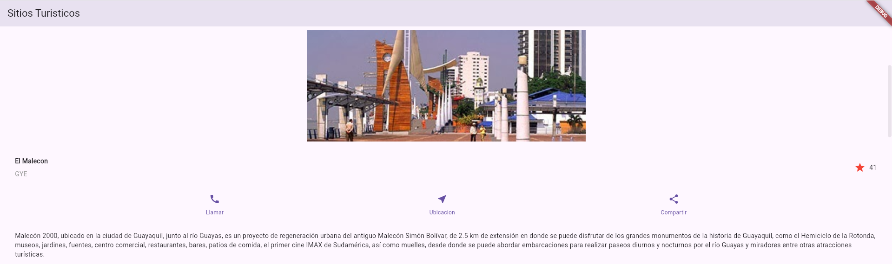
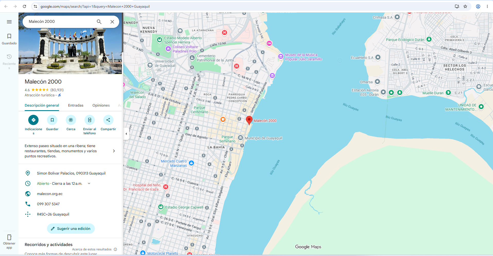

# 🇪🇨 Sitios Turísticos App

Una aplicación móvil interactiva desarrollada en **Flutter** que funciona como una guía interactiva de los principales atractivos turísticos de Ecuador (Quito, Guayaquil, Cuenca y las Islas Galápagos).

## 🚀 Características Principales

*   **Desplazamiento Vertical Fluido:** Navegación por múltiples atractivos turísticos mediante `SingleChildScrollView`.
*   **Redirección a Google Maps:** Integración con el paquete `url_launcher` para abrir la ubicación exacta de cada atractivo directamente en la aplicación de Google Maps (o navegador web).
*   **Interacciones en Tiempo Real:**
    *   **Favoritos Dinámico:** Cada sitio cuenta con un botón de estrella (`FavoriteWidget`) interactivo que permite marcarlo/desmarcarlo e incrementa o decrementa el contador en tiempo real.
    *   **Botón de Llamada:** Simulación de contacto con oficinas turísticas mediante mensajes dinámicos (`SnackBar`).
    *   **Compartir Enlace:** Opción rápida para copiar el enlace de ubicación al portapapeles.
*   **Secciones Informativas Completas:** Cada destino incluye imágenes ilustrativas de alta calidad, títulos con sus respectivas abreviaciones regionales (UIO, GYE, CUE, GLP), botones de acción y una descripción detallada.

---

## 📂 Estructura del Proyecto

Las partes esenciales modificadas en el taller:
*   [lib/main.dart](lib/main.dart): Contiene toda la lógica de los widgets (`MyApp`, `TitleSection`, `ButtonSection`, `FavoriteWidget`, etc.).
*   [pubspec.yaml](pubspec.yaml): Declaración de dependencias (como `url_launcher` para abrir enlaces) y el registro de imágenes utilizadas en la galería.
*   `images/`: Galería local de paisajes y destinos turísticos cargados en la aplicación.

---

## 🛠️ Requisitos Previos

Asegúrate de tener instalado en tu entorno de desarrollo:
*   **Flutter SDK** (versión recomendada: `^3.11.4` o superior)
*   **Dart SDK**
*   **Android Studio** / **VS Code** con extensiones de Flutter configuradas

---

## 💻 Instalación y Uso

1.  **Clonar el repositorio:**
    ```bash
    git clone https://github.com/JoelTorres981/SitiosTuristicosApp.git
    cd SitiosTuristicosApp
    ```

2.  **Obtener dependencias:**
    ```bash
    flutter pub get
    ```

3.  **Ejecutar en un emulador o dispositivo físico:**
    ```bash
    flutter run
    ```

---

## 📦 Cómo Compilar la APK

Si deseas generar el archivo instalable final para Android (APK), usa uno de los siguientes comandos:

*   **Compilación Estándar de Producción (Recomendado):**
    ```bash
    flutter build apk --release
    ```
    *Genera el archivo APK en `build/app/outputs/flutter-apk/app-release.apk`.*

*   **Compilación Dividida por Arquitectura (Para optimizar el tamaño de descarga):**
    ```bash
    flutter build apk --split-per-abi
    ```

---

## Capturas de pantalla

### Captura del Sistema



### Captura de Google Maps



## 📝 Autor
*   **Joel Torres**
